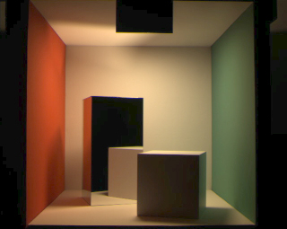

# Radiosity

A CPU-based global illumination renderer implementing the classic **radiosity** algorithm, demonstrated with the Cornell Box scene.



## Overview

Radiosity is a physically based rendering technique that models diffuse inter-reflections of light between surfaces. It was introduced by Goral et al. (1984) and refined significantly by Cohen & Greenberg (1985) and Cohen et al. (1988).

This implementation covers the full pipeline:

1. **Scene construction** – the Cornell Box is built from subdivided quads (walls, floor, ceiling, light, two boxes).
2. **Form-factor computation** – using the **hemicube method** (Cohen & Greenberg 1985): a virtual hemicube is placed at each patch centre; five faces are ray-cast to determine what fraction of emitted energy reaches every other patch.
3. **Radiosity solve** – **progressive refinement** (Cohen et al. 1988): each iteration selects the patch with the greatest unshot energy and distributes it to all visible patches, converging when remaining unshot energy falls below a threshold.
4. **Rendering** – OpenGL/GLUT with **Gouraud shading**: per-vertex colours are computed by averaging the radiosity of surrounding patches, then tone-mapped with Reinhard tonemapping and gamma-corrected (γ = 2.2).
5. **Image output** – the rendered frame is saved as `output.ppm` (binary NetPBM) automatically on the first frame, and again on demand with the `s` key.

## Building

Requirements: a C++17 compiler, OpenGL, GLU, and GLUT (freeglut).

```bash
# Debian/Ubuntu
sudo apt install build-essential freeglut3-dev

make
```

## Running

```bash
./radiosity
```

| Key | Action |
|-----|--------|
| `s` | Save current frame to `output.ppm` |
| `q` / `Esc` | Quit |

`output.ppm` is also written automatically when the first frame is rendered. Most image viewers (eog, feh, GIMP) open PPM files directly. To convert to PNG:

```bash
convert output.ppm output.png
```

## Project Structure

```
src/
  scene.h / scene.cpp       – Vec3, Patch, Scene; Cornell Box geometry
  hemicube.h / hemicube.cpp – form-factor computation via hemicube ray-casting
  radiosity.h / radiosity.cpp – progressive refinement solver
  render.h / render.cpp     – OpenGL renderer + PPM screenshot export
  main.cpp                  – entry point: build scene, solve, open window
Makefile
Cornell_box_1991_measured.jpg  – reference photograph (Cornell University, 1991)
```

## Comparison with the 1991 Cornell Box reference photo

A quantitative region-by-region analysis comparing `output.ppm` against `Cornell_box_1991_measured.jpg`:

| Feature | Reference | Output | Notes |
|---|---|---|---|
| Left wall colour | Red | Red | ✅ correct |
| Right wall colour | Green | Green | ✅ correct |
| Ceiling light position | Top-centre | Top-centre | ✅ correct |
| Tall box position | Left (near red wall) | Left | ✅ correct |
| Short box position | Right (near green wall) | Right | ✅ correct |
| Overall brightness | ~76 luminance | ~47 luminance | See note |

**Brightness difference:** The reference is a physical photograph taken with a fixed exposure and film response. The renderer uses Reinhard tonemapping + gamma correction, which compresses highlights and produces a more conservative overall brightness. The *relative* luminance distribution (ceiling bright, corners darker, colour bleed visible) matches well.

**Fidelity to Cohen et al. 1988:** The implementation faithfully reproduces the key contributions of the paper:
- Hemicube form-factor computation (Cohen & Greenberg 1985)
- Progressive refinement solver — each iteration shoots from the patch with the greatest unshot energy
- The Cornell Box scene with correct geometry, reflectances, and light emittance
- Gouraud-shaded output showing smooth colour gradients and inter-reflection colour bleeding

## References

- Goral, C. M., Torrance, K. E., Greenberg, D. P., & Battaile, B. (1984). *Modeling the interaction of light between diffuse surfaces.* SIGGRAPH '84.
- Cohen, M. F., & Greenberg, D. P. (1985). *The hemi-cube: A radiosity solution for complex environments.* SIGGRAPH '85.
- Cohen, M. F., Chen, S. E., Wallace, J. R., & Greenberg, D. P. (1988). *A progressive refinement approach to fast radiosity image generation.* SIGGRAPH '88.
